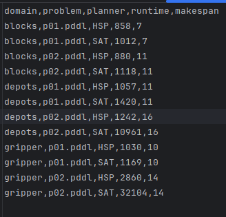
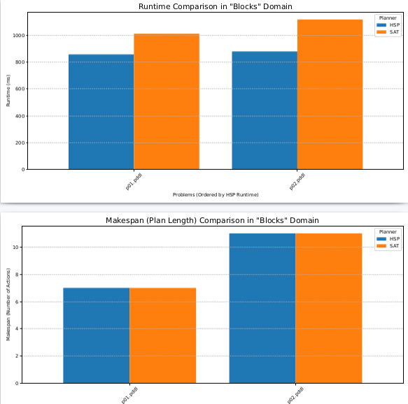
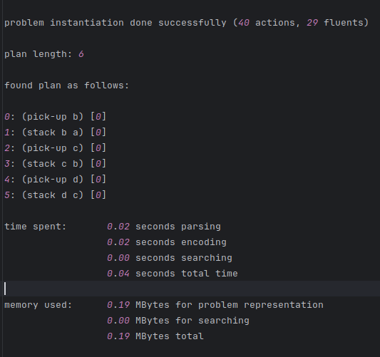

# PDDL4J SAT Planner and Performance Comparison

This project implements a custom automated planner that solves planning problems by encoding them into Boolean Satisfiability (SAT) problems. The SAT encoding is then solved using the SAT4J library.

The primary goals of this project are:
1.  To implement a SAT-based planner in Java using the PDDL4J library.
2.  To create an automated experiment script to compare the performance of this custom SAT planner against the standard Heuristic Search Planner (HSP A*) provided in thr PDDL4J documentation.
3.  To visualize the resulst of the comparison across four standard planning domains: `blocksworld`, `depot`, `gripper`, and `logistics`.

---

## Author
Ababacar Dioukhané
Research Engineer


---

## Project Structure
The project use the default PDDL4J architecture. It was downloaded first.
It is then organized into the following directories and files:

```
pddl4j-master/
├── build.gradle                # The main build configuration file
├── gradlew                     # The Gradle wrapper script
├── scripts/                    # All experiment scripts are here
│   ├── comparaison.sh          # Runs the benchmarks for both planners
│   └── results.py              # Generates plots from the results
├── src/
│   └── main/
│       └── java/
│           └── fr/uga/pddl4j/examples/sat/
│               ├── benchmarks/ # The 4 benchmark domains organized just for the experiments
│               ├── classes/    # JAVA classes for SAT planner code (Planner.java, Encoder.java)
│               └── hsp/        # The command-line wrapper for the HSP planner (ASP.java)
└── results/                    # Generated by the scripts
    ├── logs/                   # Log files of each planner run
    ├── performance.csv         # The CSV data with runtime and makespan
    └── comparison_plots.pdf    # The final PDF with 8 comparison figures
```

---

## Prerequisites

*   **Java Development Kit (JDK)**: Version 8 or higher.
*   **Python 3**: With `pandas` and `matplotlib` libraries installed.
    ```bash
    pip install pandas matplotlib
    ```
*   **Gradle**: The project includes the Gradle Wrapper (`gradlew`)

---

## How to Build and Run

> **Note:** All commands must be executed from the **root directory** of the project (`pddl4j-master/`).

### Step 1: Build the Project

This project uses the `shadowJar` Gradle plugin to create a single, executable "fat jar". This JAR file includes all necessary dependencies (like SAT4J and Picocli), making it easy to run.

You only need to run this command **once**, or whenever you make changes to the `.java` source files.

```bash
# This command cleans previous builds and creates the new fat jar
./gradlew clean shadowJar
```
This will create the runnable JAR at `build/libs/pddl4j-4.0.0-all.jar`.

### Step 2: Run the Experiments

The `comparaison.sh` script automates the entire experiment. It will:
*   Loop through all problems in the 4 benchmark domains.
*   Run both the custom SAT planner and the HSP planner on each problem.
*   Measure the runtime and makespan (plan length) for each run.
*   Save all data to `results/performance.csv`.

To run the experiments, execute the following command from the project root:

```bash
./scripts/comparaison.sh
```
This process may take several minutes to complete.

### Step 3: Generate the Result Plots

After the `comparaison.sh` script has finished and created the `performance.csv` file, you can generate the required plots.

The `results.py` script reads the CSV data and generates 8 comparison figures (one for runtime and one for makespan for each of the 4 domains), saving them into a single PDF document.

```bash
python3 ./scripts/results.py
```

---

## Output

After running the build and experiment scripts, the following outputs will be available in the `results/` directory:

*   **`results/performance.csv`**: A CSV file containing the raw performance data with the following columns: `domain`, `problem`, `planner`, `runtime`, `makespan`.


*   **`results/comparison_plots.pdf`**: The final deliverable PDF containing all 8 comparison plots, as required by the assignment.


*   **`results/logs/`**: This directory contains the raw console output from every single planner run, which is useful for detailed debugging.



---

## Core Technologies Used

*   **PDDL4J**: The core framework for parsing and handling PDDL files.
*   **SAT4J**: The SAT solver used to find a solution to the Boolean satisfiability problem.
*   **Picocli**: A modern library for creating user-friendly command-line interfaces in Java.
*   **Gradle**: The build automation tool used to compile the project and manage dependencies.
